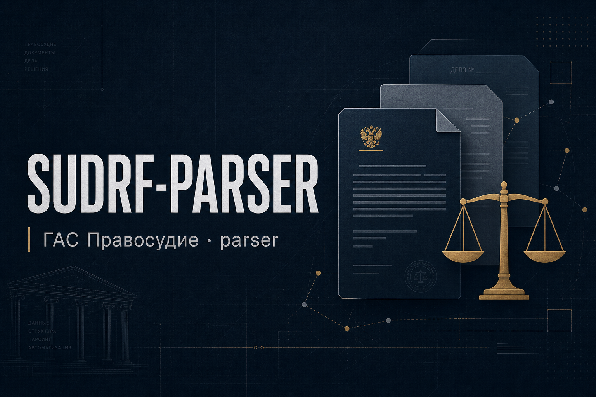
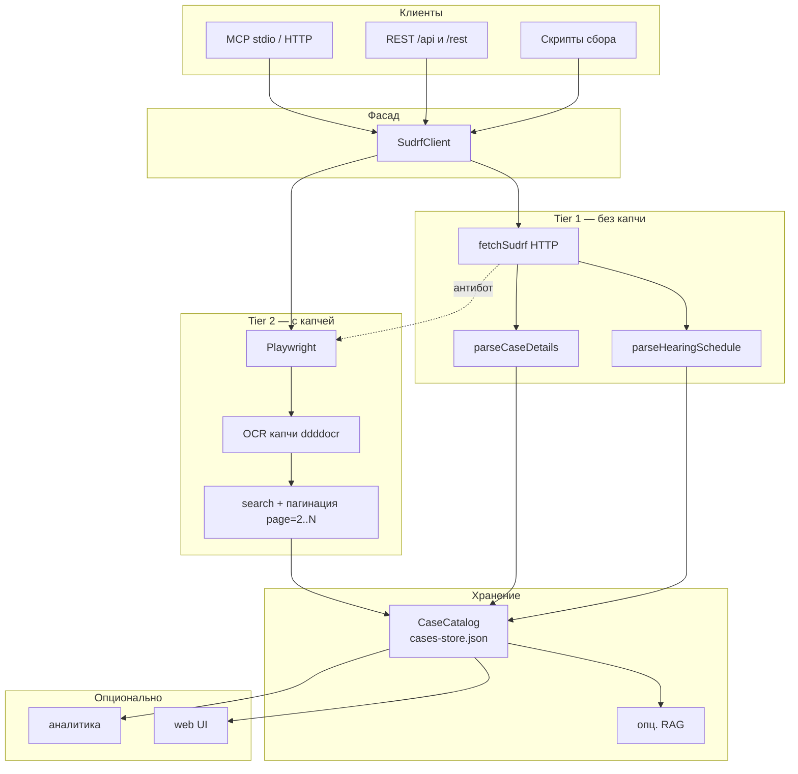
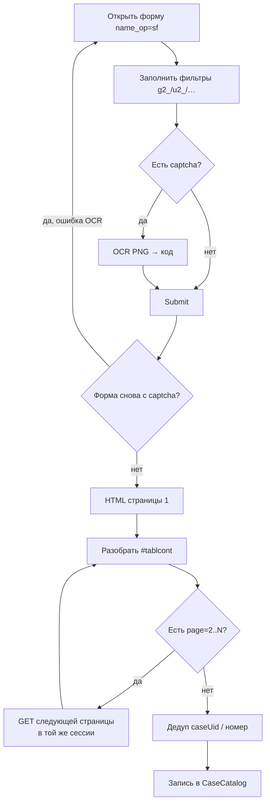

<p align="center">
  
</p>

<h1 align="center">SUDRF-PARSER</h1>

<p align="center">
  <strong>MCP-сервер и парсер ГАС «Правосудие»</strong><br/>
  <a href="https://sudrf.ru">sudrf.ru</a> · расписание · поиск дел · карточки · судебные акты
</p>

<p align="center">
  <a href="#лицензия">Лицензия</a> ·
  <a href="#возможности">Возможности</a> ·
  <a href="#как-работает-парсер">Как работает</a> ·
  <a href="#установка">Установка</a> ·
  <a href="PARSER.md">Только парсер</a> ·
  <a href="#автор-и-контакты">Контакты</a>
</p>

<p align="center">
  
  
  
  
  
  <a href="https://t.me/IBlog_Ivan"></a>
</p>

---

Позволяет получать **расписание заседаний**, искать дела (номер / УИД / участник / ИНН / судья / даты) и вытягивать **карточку дела** с судебными актами. Есть REST API, опциональный веб-кабинет и OAuth для удалённых MCP-клиентов.

| | |
|---|---|
| **Автор** | Андреев Иван |
| **Связь** | [t.me/IBlog_Ivan](https://t.me/IBlog_Ivan) — лицензия, коммерция, вопросы |
| **Репозиторий** | [Ivantech123/SUDRF-PARSER-](https://github.com/Ivantech123/SUDRF-PARSER-) |

## Лицензия

См. [LICENSE](LICENSE).

| Режим | Условие |
|--------|---------|
| **Бесплатно** | Использование в любых объёмах |
| **Платно** | Прибыль **на парсере как продукте** (SaaS / API / выгрузки / white-label) → **10%** чистой прибыли автору |

Вопросы по лицензии: [t.me/IBlog_Ivan](https://t.me/IBlog_Ivan).

## Возможности

| Модуль | Что делает |
|--------|------------|
| **Tier 1** | Расписание заседаний без капчи · обогащение карточек по ссылке |
| **Tier 2** | Расширенный поиск с капчей · пагинация выдачи |
| **Карточка** | Участники · движение дела · тексты актов |
| **Реестр** | ~2269 судов РФ · поиск по имени / региону / `vnkod` / поддомену |

Только ядро без UI: **[PARSER.md](PARSER.md)**.

---

## Как работает парсер

### Задача, которую решает код

Портал ГАС «Правосудие» — не единый API, а **тысячи отдельных сайтов судов** вида `{subdomain}.sudrf.ru`. У каждого свой поддомен, но общий модуль делопроизводства `sud_delo`: расписание заседаний, форма расширенного поиска, карточка дела, тексты актов.

Данные отдаются как **HTML** (часто в кодировке Windows-1251). Часть страниц открыта без капчи, часть форм поиска защищена капчей, часть запросов режет антибот. Готового машиночитаемого контракта «отдай все дела региона JSON’ом» нет.

Этот проект делает то же, что делает человек в браузере, но программно:

1. находит нужный суд в реестре (или принимает поддомен напрямую);
2. ходит на нужные URL / заполняет форму;
3. при необходимости решает капчу;
4. разбирает HTML в структуры (дела, участники, акты);
5. складывает результат в локальный каталог и отдаёт наружу через MCP / REST.

Регион и список судов **не зашиты**: задаются переменными окружения или аргументами запуска. Один и тот же код работает с любым судом из реестра (~2269 площадок РФ).

### Блок-схема системы



Та же схема текстом (если mermaid не отрисовался):

```
                    ┌─────────────────────────┐
                    │  MCP / REST / скрипты   │
                    └───────────┬─────────────┘
                                │
                                ▼
                    ┌─────────────────────────┐
                    │      SudrfClient        │
                    │  schedule / search /    │
                    │     getCaseDetails      │
                    └───────────┬─────────────┘
                     ┌──────────┴──────────┐
                     ▼                     ▼
          ┌──────────────────┐   ┌─────────────────────┐
          │  Tier 1  HTTP    │   │  Tier 2  Playwright │
          │  расписание      │   │  форма + капча OCR  │
          │  карточка дела   │   │  поиск + page=2..N  │
          └────────┬─────────┘   └──────────┬──────────┘
                   │     антибот ──fallback─┘
                   ▼                     ▼
          ┌──────────────────────────────────────────┐
          │         CaseCatalog (cases-store.json)   │
          └───────────────────┬──────────────────────┘
                ┌─────────────┼─────────────┐
                ▼             ▼             ▼
           MCP/REST      опц. RAG      опц. UI/аналитика
```

### Два уровня доступа к sudrf

**Tier 1** — «лёгкий» путь. Plain HTTP, без браузера и без капчи. Подходит для:

- списка дел, назначенных на конкретную дату (`H_date=…`);
- уже известной карточки по `caseUrl` (обогащение: участники, движение, тексты актов).

Ограничение: так **нельзя** выгрузить всю историю суда «с 2010 по сегодня» — на доске заседаний только то, что назначено. Архив открывается через поиск.

**Tier 2** — «тяжёлый» путь. Реальный Chromium (Playwright), форма расширенного поиска, капча, потом листание страниц выдачи. Подходит для:

- поиска по дате поступления, участнику, судье, номеру, УИД, статье;
- исторического backfill по окнам дат и категориям производства (`delo_id`).

Цена: время на навигацию и OCR. Поэтому после одной капчи важно **забрать все страницы выдачи**, а не только первые 25 строк.

| | Tier 1 | Tier 2 |
|---|--------|--------|
| Транспорт | HTTP GET/POST | Playwright |
| Капча | нет | да |
| Типичная задача | расписание, enrich карточки | discovery / архивный поиск |
| Узкое место | антибот, TLS | капча + сессия браузера |

### Блок-схема одного запроса Tier 2



### Tier 1 подробно

1. Собирается URL:  
   `https://{subdomain}.sudrf.ru/modules.php?name=sud_delo&srv_num=1&H_date=DD.MM.YYYY`  
   (для части судов — `http://`, см. флаг `http` в реестре).
2. Ответ читается как байты → кодировка Windows-1251 или UTF-8 → строка HTML.
3. До разбора таблицы проверяются сигналы антибота (Qrator, WebKnight, ddos-guard, …). Challenge-страницу парсить нельзя — это не расписание.
4. Ищется `#tablcont` (или запасная таблица по заголовкам «номер дела» / «время»).
5. Строки-секции («Гражданские дела — апелляция») без ссылки на дело пропускаются.
6. Из ячейки «информация по делу» линии `КАТЕГОРИЯ:`, `ИСТЕЦ:`, `ОТВЕТЧИК:` выделяются по `<br>`, а не по склейке `.text()`.

Карточка дела (`getCaseDetails`) идёт тем же HTTP-путём по `caseUrl`. Если антибот мешает — тот же URL открывается в уже тёплом браузере Tier 2.

### Tier 2 подробно

1. Playwright открывает форму поиска категории (`delo_id`: гражданские `5`, уголовные `4`, КоАП `1540006`, КАС `1540005`, апелляция `41`, …).
2. `buildSearchParams` переводит нормальные поля (`entryDateFrom`, `participantName`, …) в реальные имена инпутов sudrf (`g2_case__ENTRY_DATE1D`, `U2_DEFENDANT__NAMESS`, …).
3. Капча — PNG в `data:image/png;base64,…` (иногда с пробелом после `data:`). Перед OCR пробелы вычищаются. Решает **резидентный** процесс ddddocr (модель один раз в памяти). Цепочка: локальный OCR → опционально 2Captcha.
4. Неверный код → форма с новой картинкой → фильтры заполняются заново → повтор.
5. Успешный ответ — таблица результатов. На странице обычно до **25** дел. Текст «Всего по запросу найдено — N» даёт полный объём.
6. Пагинация: из HTML вытаскиваются ссылки `page=2`, `page=3`, … (и стрелки `>` / `>>`). Обход BFS: на каждой новой странице снова читается окно ссылок, потому что sudrf показывает не все номера сразу. Капчу на page≥2 решать не нужно — сессия уже прошла гейт.
7. Строки с разных страниц сливаются; дубликаты режутся по `caseUid` или номеру дела.

Суды с `http=true` и `captcha=false` могут искать через HTTP POST без браузера; при antibot — автоматический откат на Playwright.

### Карточка дела: на что ломается вёрстка

Модуль `case-parser.ts` разбирает блоки `cont*`:

- **cont1** — шапка/реквизиты. В апелляционных карточках строки «Номер дела» может не быть: производственный номер часто только в тексте акта («Дело №…»). Тогда номер берут из документа, а номер первой инстанции — отдельным полем.
- **cont3 / cont4** — «ДВИЖЕНИЕ ДЕЛА» / «УЧАСТНИКИ». Первая строка таблицы часто **одна ячейка-заголовок**, настоящие колонки — со второй строки. Нельзя брать `.first()` как header row.
- **Акты** — тип документа (РЕШЕНИЕ, ОПРЕДЕЛЕНИЕ, ПРИГОВОР, СУДЕБНЫЙ ПРИКАЗ, …) ищется regex’ом. Резать текст по `". "` нельзя: адрес «г. …» даёт ложный разрыв.

### Каталог и конвейер массового сбора

`cases-store.json` — рабочее хранилище карточек: суд, номер, УИД, ссылка, даты сбора/обогащения, документы.

Практичный порядок работы:

1. **Discovery** — Tier 2: суд × `delo_id` × окно дат → короткие карточки со ссылками.
2. **Enrich** — Tier 1 (или браузер при блоке): по каждой `caseUrl` полная карточка и тексты актов.
3. Параллелить по **разным судам** (отдельные сессии), а не рвать один поисковый запрос на несколько браузеров.
4. Чекпоинт заданий вида `court|delo|dateFrom|dateTo` — чтобы продолжить после обрыва.
5. Широкие даты дробить на месяцы/кварталы, если суд или таймаут не тянут огромное окно.

RAG, веб-кабинет и аналитика покрытия — **надстройки**. Для чистого парсинга достаточно `SudrfClient` + каталог (+ планировщик или Go-worker для Tier 1).

### Устойчивость

- Детект antibot до попытки разобрать таблицу.
- Retry HTTPS → HTTP на судах с битым TLS.
- Повтор капчи с полной перезагрузкой формы.
- Один тёплый browser context: cookies живут между страницами выдачи.
- Резидентный OCR: без перезапуска Python на каждую картинку.

### Что не обязательно поднимать

| Выключить / не деплоить | Что останется |
|-------------------------|---------------|
| Нет `MCP_TRANSPORT=http` | Локальный MCP по stdio |
| Нет каталога `web/` на сервере | Парсер + API без UI |
| `AUTO_PARSER=0` | Только ручные вызовы tools / скрипты |
| Без RAG | Каталог и сырые ответы без полнотекстового индекса |

---

## Установка

Требуется **Node ≥ 20.18.1** (ограничение `undici@7` и `cheerio@1`) и Python 3 для OCR капчи.

```bash
git clone https://github.com/Ivantech123/SUDRF-PARSER-.git sudrf-mcp
cd sudrf-mcp
npm install
npx playwright install chromium
pip install ddddocr pillow
npm run build
```

### Проверка сборки

```bash
npm run typecheck   # tsc по src + test
npm test            # 93 офлайн-теста, без запросов к sudrf.ru
```

Тесты работают на сохранённых страницах из `scripts/*.html`, сеть не нужна —
их можно запускать в CI и на машине без доступа к ГАС «Правосудие».

### Капча

1. **ddddocr** (локальный OCR) — основной способ.
2. **2Captcha** — опциональный резерв (`TWOCAPTCHA_KEY`).

## Переменные окружения

| Переменная | По умолчанию | Описание |
|---|---|---|
| `TWOCAPTCHA_KEY` | — | Резерв капчи. |
| `SUDRF_HEADLESS` | `1` | `0` — показать браузер. |
| `PARSER_REGION` | — | Код субъекта РФ для автосбора (не задан = без фильтра). |
| `DISPLAY_REGION` | — | Фильтр UI/API по региону (пусто = все). |
| `SUDRF_CASES_PATH` | `./cases-store.json` | Каталог карточек. |
| `SUDRF_RAG_PATH` | `./rag-index.json` | RAG-корпус. |
| `SUDRF_AUTH_PATH` | `./auth-store.json` | Кабинет. |
| `SUDRF_OAUTH_PATH` | `./oauth-store.json` | OAuth store. |
| `MCP_TRANSPORT` | `stdio` | `http` — Streamable HTTP. |
| `MCP_PORT` | `8080` | Порт. |
| `MCP_BIND` | все интерфейсы | Например `127.0.0.1`. |
| `MCP_PUBLIC_URL` | `http://localhost:PORT/mcp` | Публичный URL `/mcp`. |
| `AUTO_PARSER` | — | `1` — автосбор; в `http` режиме включается по умолчанию (отключить: `0`). |
| `AUTO_TIER2` | — | `1` — фоновый Tier-2 поиск. |

### Надёжность и вежливость HTTP (Tier 1)

Транспорт сам переживает кратковременные `429`/`5xx` и держит паузу между
запросами к одному суду, чтобы не ловить бан Qrator.

| Переменная | По умолчанию | Описание |
|---|---|---|
| `SUDRF_MAX_RETRIES` | `3` | Повторы после первой попытки при `429`/`5xx`/обрыве связи. `0` — без повторов. |
| `SUDRF_RETRY_BASE_MS` | `800` | Базовый шаг backoff; удваивается, со случайным джиттером. |
| `SUDRF_RETRY_CAP_MS` | `15000` | Максимальная пауза между повторами. |
| `SUDRF_MAX_RETRY_AFTER_MS` | `60000` | Предел, до которого уважается заголовок `Retry-After`. |
| `SUDRF_MIN_INTERVAL_MS` | `250` | Минимальный интервал между запросами к **одному** поддомену. `0` — выключить. |
| `SUDRF_HTTP_PROXY` | — | Один или несколько шлюзов через запятую — ротация по кругу на каждый запрос. |

Запросы к разным судам по-прежнему идут параллельно: ограничение действует
только внутри одного поддомена.

## Локальный MCP (stdio)

```bash
node dist/index.js
```

Пример конфига клиента:

```json
{
  "mcpServers": {
    "sudrf": {
      "command": "node",
      "args": ["/absolute/path/to/sudrf-mcp/dist/index.js"],
      "env": { "SUDRF_HEADLESS": "1" }
    }
  }
}
```

## HTTP / REST / OAuth

```bash
MCP_TRANSPORT=http MCP_PORT=8080 MCP_BIND=127.0.0.1 node dist/index.js
```

```bash
curl -X POST \
  -H "Authorization: Bearer YOUR_TOKEN" \
  -H "Content-Type: application/json" \
  -d '{"court":"mosgorsud","date":"25.01.2025"}' \
  http://localhost:8080/rest/get_hearing_schedule
```

Документация: [REST_API.md](REST_API.md), примеры в [examples/](examples/).

OAuth 2.0 (DCR, PKCE, revoke) — для удалённых MCP-клиентов; см. `src/auth/`.

## Реестр судов

`src/sudrf/courts.ts` — ~2269 судов РФ (поддомен, регион, `vnkod`, флаги `captcha` / `http`).

Поддомен смотрите в адресе суда на sudrf.ru. Регенерация: `npx tsx scripts/gen-courts.ts <config_sudrf.json>`.

## Разработка

```bash
npm run typecheck
npm run build
npm run test:case-parser
```

## Структура (кратко)

- `src/sudrf/` — HTTP/браузерный клиент, парсеры, капча
- `src/parser/` — планировщики сбора
- `parser-worker/` — Go worker для Tier-1 расписаний
- `src/cases/` — каталог карточек
- `web/` — опциональный UI (можно не деплоить)

---

## Автор и контакты

<p align="center">
  <strong>Андреев Иван</strong><br/>
  Telegram: <a href="https://t.me/IBlog_Ivan">https://t.me/IBlog_Ivan</a><br/>
  <sub>лицензия · коммерция · вопросы по парсеру</sub>
</p>
